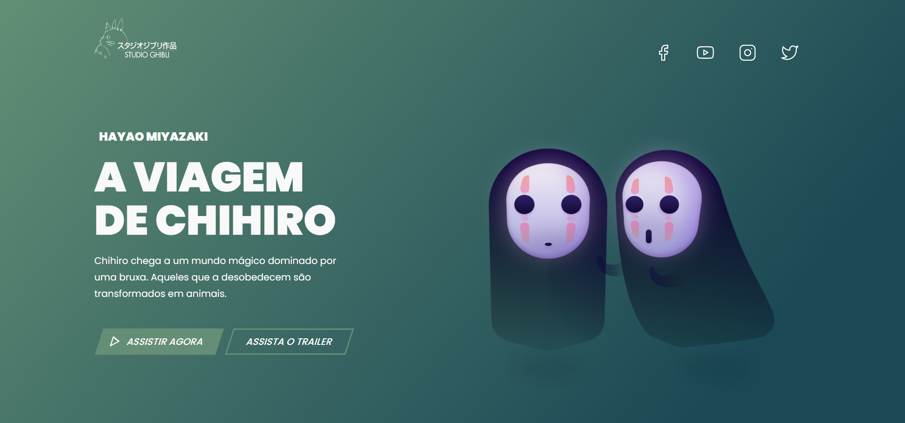

# Challenge-05-Codelandia

> Essa aplicação é a resolução de um desafio proposto no servidor da Codelândia 
>
## Linguagens utilizadas

- [HTML](https://developer.mozilla.org/pt-BR/docs/Web/HTML)
- [JavaScript](https://developer.mozilla.org/pt-BR/docs/orphaned/Web/JavaScript)
- [SASS](https://sass-lang.com/)

## 🤝 Colaboradores

Agradecemos às seguintes pessoas que contribuíram para este projeto:

<table>
  <tr>
    <td align="center">
      <a href="#">
         
        
          <b>Nikolas-as</b>
        
      </a>
    </td>
</table>

